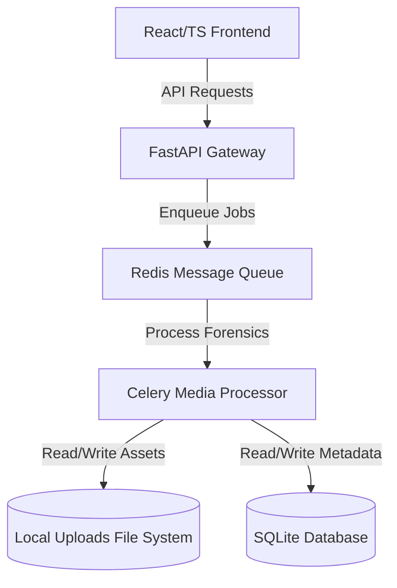

# 02. Technical Requirements Document (TRD)

## 🏗️ 1. System Architecture

Veridact uses a decoupled client-server architecture to optimize file processing pipelines.

- **Frontend**: Single Page Application (React) communicating via RESTful JSON.
- **Backend API**: Light gateway for metadata, auth, and job management.
- **Processing Worker**: Heavy processing for video and image algorithms.

---

## 🔒 2. Security & Compliance
- **Data Protection**: AES-256 encryption for media storage; TLS 1.3 for communications.
- **Input Validation**: Strict validation of MIME types, magic numbers, and maximum file sizes (e.g., 50MB for images, 500MB for video).
- **Authentication**: JWT token-based authentication with auto-expiration.

---

## 🔌 3. External & Internal APIs
- **GET /api/v1/media**: Retrieve analysis lists.
- **POST /api/v1/media/upload**: Multipart upload endpoint for suspect files.
- **GET /api/v1/media/:id/analyze**: Trigger specific forensic pipeline (EXIF, ELA, noise).
- **GET /api/v1/reports/:id/export**: Export PDF representation of findings.

---

## ⚡ 4. Performance & Scalability
- Asynchronous media upload with chunking for large files.
- Background worker execution for heavy operations (neural net models, video ELA).
