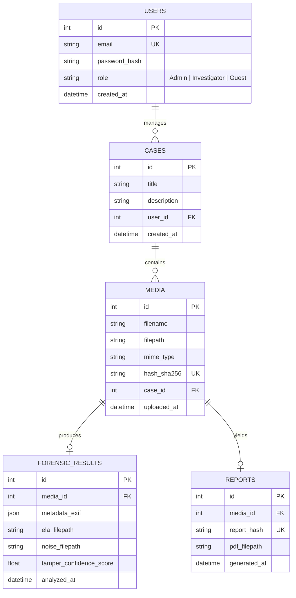

# 05. Backend Schema and Database Design

## 🗄️ 1. Database Schema (SQLite Relational Model)

Below is the database table configuration.

---

## ⚡ 2. Indexing, Performance & Storage Setup
- **Unique Indexes**: Ensure `hash_sha256` in the `MEDIA` table is indexed to prevent processing duplicate files.
- **Foreign Keys**: Enforce referential integrity checks on deletion cascades.
- **Storage Strategy**: Original media, ELA result images, and exported PDF reports are saved in structured folders (`uploads/evidence/`, `uploads/heatmaps/`, `uploads/reports/` respectively) with only file references stored in the database.
